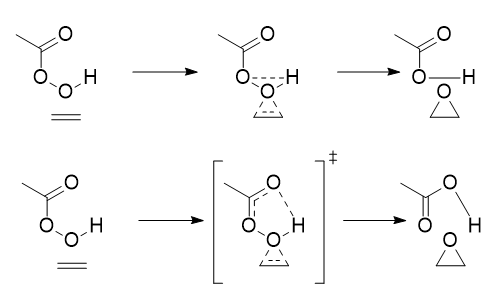
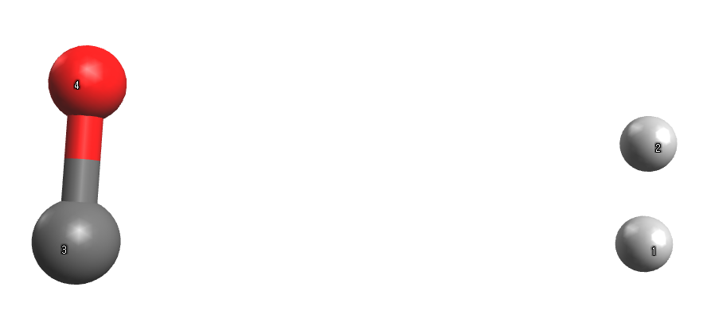

# AutoCG

A package for generating optimial reactant/product structures for transition state (TS) searches.

# Requirements

- python ≥ 3.7
- numpy
- scipy ≥ 1.11.0
- cclib = 1.7.1 (If users can only use Gaussian)
- CREST 6.2.3 (Link: [https://github.com/crest-lab/crest](https://github.com/crest-lab/crest), if users want to perform TS conformation sampling)

# Settings

Before using autoCG, following things should be prepared:

1. Basically, PYTHONPATH should be specified where the package was clone to:
    
    ```jsx
    >> export PYTHONPATH=<git clone path>
    ```
    
2. Quantum chemistry (QC) package should be configured. For example, if users want to use Gaussian, either ‘which g09’, or ‘which g16’ should be correctly identified, as following:
    
    ```jsx
    >> which g16
    >> /appl/Gaussian16/AVX_revB01/g16/g16
    
    >> which orca
    >> /appl/orca_4.2.1/orca_4_2_1_linux_x86-64_openmpi314/orca
    ```
    
3. Depending on the QC package that you are using, environment variable CALCULATOR should be specified as following:
    
    ```jsx
    >> export CALCULATOR=gaussian (If users want to use gaussian program
    >> export CALCULATOR=orca (If uses want to use orca program)
    ```
    
    Currently, only gaussian and orca program are available for autoCG!
    

# Executing AutoCG

AutoCG mainly takes two input types: **SMILES** and **3D coordinates.**

**In the case of SMILES,** you can run autoCG by specifying the reaction SMILES with the following command:

```jsx
python generate.py "[H][H].[C-]]#[O+]>>C=O" -sd <SAVE DIRECTORY> -wd <WORKING DIRECTORY>
```

The package will generate  well-aligned reactant and product structures for transition state search input in the specified save directory. The output of QC packages is written to the working directory to avoid messy outputs. 

When the reaction SMILES is given, the package automatically computes the bond changes of given reactions, in such a way that minimal bond dissociation and formation are required to convert the reactant to the product. The detailed algorithm and implementation of such bond changes can be found at [https://pubs.acs.org/doi/full/10.1021/ci3002217](https://pubs.acs.org/doi/full/10.1021/ci3002217).

If the atom mapping is provided in the SMILES, we simply identify the bond changes using the provided mapping. For the previous example, the reaction SMILES can also be given as follows:

```jsx
python generate.py "[H:1][H:2].[C-:3]#[O+:4]>>[O:4]=[C:3]([H:1])[H:2]" -sd <SAVE DIRECTORY> -wd <WORKING DIRECTORY>
```

This detailed input is useful, when there can be several different bond changes that can convert reactant to product. Representative examples are shown in the figure below:



For such reactions, in order to give accurate reaction information, the atom mapping should be given in the reaction SMILES. Of course, this input is more complicated to prepare, as all atom mappings, including the hydrogens, should be accurately assigned.

Another input type is 3D coordinate. Here, the input file named “input.com” should be provided as the following (See example/input.com)

```jsx
0 1 # Charge multiplicity
H 0.35400009037695684 0.0 0.0
H -0.35400009037695684 0.0 0.0
C 0.5640604828962581 0.0 4.0
O -0.5640604828962581 0.0 4.0
# Must give empty line
1 2 B # Bond change information: B -> break, F-> form
1 3 F
2 3 F
```

The geometry is the reactant geometry, and reaction information (bond changes) is given after an empty line. The initial geometry looks like



The important feature is that the reactant geometry **does not have to be well-aligned.** Any geometry whose connectivity matches the reactant is an appropriate input. Such geometry can be easily generated from the SMILES using make_xyz.py in the utils folder:

```jsx
>> python make_xyz.py '[H][H].[C-]#[O+]'
>>
H 0.35400009037695684 0.0 0.0
H -0.35400009037695684 0.0 0.0
C 0.5640604828962581 0.0 4.0
O -0.5640604828962581 0.0 4.0
```

Once the ‘’input.com’’ is prepared, you can generate the desired input structures for the TS search with the following command:

```jsx
>> python generate.py "/home/lkh/test/input.com" -sd <SAVE DIRECTORY> -wd <WORKING DIRECTORY>
```

# Output

AutoCG gives a well-aligned reactant and product structures for nice inputs for TS searches in the given save directory. In the SAVE DIRECTORY, a number of folders are created, where distinct reactant/product structures are contained in the folder.

In the folder, following output files can be found:

- initial_ts.xyz: The geometry of starting pseudo-TS structure
- TS_to_R.xyz, TS_to_P.xyz: Trajectory of constrained scan optimization transforming pseudo-TS structures to pseudo-reactant, pseudo-product structures.
- opt_R.xyz, opt_P.xyz: Conformation relaxation process of pseudo-reactant and pseudo-product structures.
- UFF_R.xyz, UFF_P.xyz (If UFF preoptimization activated): Result of UFF pre-optimization prior to conformation relaxation
- R.xyz, P.xyz: Final relaxed reactant/product conformations that can be readily used for TS searches.

A guess.log file is created in the save directory, summarizing the result of the conformation generation.

# Arguments in autoCG

In our algorithm, there are several hyperparameters that control the generation of reaction conformations. We list up all (not all, but some critical factors) the parameters and their effects in the generation:

- save_directory (-sd): Directory for saving conformations tailored for TS searches
- working_directory (-wd): Directory for processing quantum chemical calculations
- num_conformer (-nc): Maximum number of distinct conformations to generate
- scan_num_relaxation(-snr): Maximum number of optimization during constrained scan optimization
- num_relaxation (-nr): Maximum number of optimization during the conformation relaxation
- ts_scale (-ts): scale factor for adjusting pseudo-TS structures, bond lengths associated with bond formation and dissociation are adjusted to the value the sum of the two atomic radii multiplied by scale factor
- form_scale (-fs): Scale factor for setting target distance value of bond formations in constrained scan optimization.
- break_scale (-bs): Scale factor for setting target distance value of bond dissociations in constrained scan optimization.
- step_size (-ss): Step size (coordinate update step size) during the constrained scan optimization
- scan_qc_step_size (-sqc): Trust radius value during the constrained scan optimization. This value should be not big in order to maintain the good alignment
- qc_step_size (-qc): Trust radius value during the conformation relaxation. This value should be not big in order to maintain the good alignment
- energy_criteria (-ec): the termination criteria value for the conformation relaxation. The unit is in kcal/mol.
- preoptimize (-p): Whether to perform UFF pre-optimization before conformation relaxation.
- stereo_enumerate (-se): Whether to perform stereoisomer enumration for multiple TS conformation sampling.
- use_crest (-uc): Whether to perform CREST sampling for multiple TS conformation sampling.
- check_connectivity (-cc): Whether to check connectivity of the generated conformations match the given reactant product. The matching results are written in the guess.log
- check_stereo (-cs): Whether to check the stereochemistry of the generated conformations match the given reactant structures. When using this, the reactant geometry should be accurately provided, matching the desired stereochemsitry. The matching results are written in the guess.log
- window (-w): Energy window value to screen conformations that are similar each other. The unit is in kcal/mol. (This is not an accurate method, so use it only when you want to obtain accurate TS structures)

# Implementation for Calculator

Currently, the package only supports Gaussian and orca. For other quantum chemistry packages, the users should implement new python script to run 

[Implementation of Calculator](subpage/details.md)

# License

The whole package is under BSD-3-license

# Contact Information

Please e-mail me to here: [kyunghoonlee@kaist.ac.kr](mailto:kyunghoonlee@kaist.ac.kr) for more detail discussion


